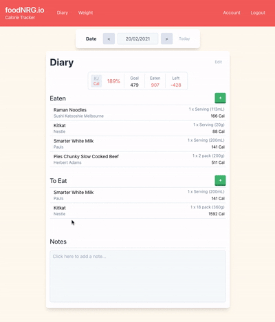
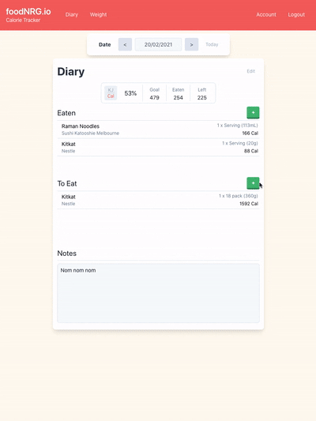

# calorie-tracker
This is the first larger project I’ve created, I’d love any feedback or input. It started as what I thought would be a small weekend project and turned into something a bit bigger! 

The frontend is using React with react-query for the server state management, the backend is built with node, express and mongoose with passportJS for authentication. It's still a work in progress and there's still some work to do before it can be deployed.

## Demo
 &nbsp;&nbsp;&nbsp;&nbsp; 

## Installing

Since moving to react v17 error corrupts npm installs so yarn is required for now

```console
$ cd calorie-tracker
$ yarn install
$ cd client_web
$ yarn install 
$ cd ..
$ cd api
$ yarn install
$ cd ..
```
### /api/.env Example

```console
MONGOOSE_DEBUG=false

PORT=5000

DB_DEV_URI=
DB_TEST_URI=
DB_PROD_URI=

APP_SECRET=shhhhhhhh
```

### /client_web/.env Example
If REACT_APP_USE_LOCAL_DB not set client_web app will use Mock Service Worker (MSW) handlers

```console
REACT_APP_USE_LOCAL_DB=true
```

## Running
### Client & API
```console
$ cd calorie-tracker
$ npm start
// runs prestart then client and api in development environment in parallel
``` 
### Client only
```console
$ cd calorie-tracker
$ npm run client
// runs client only with prestart
``` 

### API only
```console
$ cd calorie-tracker
$ npm run api
// runs api only in development environment
``` 